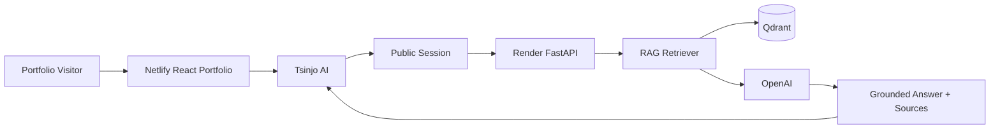

# Sandaniaina Tsinjo Nantosoa — AI Engineer Portfolio

React, TypeScript and Vite portfolio for production RAG systems, governed AI agents, backend engineering and automation.

## Tsinjo AI — Portfolio Assistant

Tsinjo AI is a public, read-only RAG assistant embedded as a lazy-loaded enhancement. It streams concise answers grounded in curated portfolio evidence and returns deterministic source cards, relevant CTAs and follow-up questions.



The browser receives only a short-lived anonymous JWT fixed to the `portfolio_chat` scope and `portfolio` tenant. Messages and the token live in `sessionStorage`; there are no frontend secrets, agent tools or write operations. The API adds explicit CORS, per-IP and per-session limits, request IDs, input/output limits, guardrails and source deduplication.

The assistant deliberately uses a low-cost production configuration:

- `gpt-4o-mini` for grounded answer generation;
- `text-embedding-3-small` for search embeddings;
- four retrieved chunks by default;
- a 450-token maximum answer;
- deterministic refusals for obvious attacks, unsupported requests and empty retrieval;
- explicit ingestion instead of embedding the corpus during application startup.

## Local development

### Frontend

```powershell
npm ci
Copy-Item .env.example .env.local
npm run dev
```

```env
VITE_CONTACT_API_URL=
VITE_PORTFOLIO_AI_API_URL=http://localhost:8000
```

The portfolio runs on `http://localhost:8080`. If `VITE_CONTACT_API_URL` is empty, the contact form uses Netlify Forms. Never put OpenAI, Qdrant, JWT or long-lived API secrets in a `VITE_*` variable.

### Backend, Qdrant and ingestion

Python 3.11+ and a Qdrant instance are required.

`pyproject.toml` remains the dependency metadata source. Production installs the fully pinned `requirements.lock`; local/test validation uses `requirements-dev.lock`. Regenerate both with `pip-compile` after changing Python dependencies.

```powershell
Set-Location portfolio-ai-api
python -m venv .venv
.venv\Scripts\Activate.ps1
pip install -r requirements-dev.lock
Copy-Item .env.example .env
Set-Location ..
npm run knowledge:build
Set-Location portfolio-ai-api
python scripts/ingest_portfolio.py --dry-run
python scripts/ingest_portfolio.py
uvicorn app.main:app --reload --port 8000
```

`npm run knowledge:build` currently derives 51 public chunks from `src/data/projects.ts` and `src/data/experience.ts`, validates internal routes, and writes the reviewable JSON corpus. Rerun the build and ingestion after significant portfolio content changes. Ingestion uses stable UUID5 point IDs and removes stale points only from the dedicated `portfolio_knowledge` collection. `--recreate` deliberately replaces that collection.

Health endpoints:

- `GET /health` checks that the API process is alive.
- `GET /ready` checks configuration and that the Qdrant collection exists and is non-empty.

The recruiter evaluation dataset lives at `portfolio-ai-api/tests/evals/recruiter_questions.json`. After ingestion, run `python scripts/evaluate_retrieval.py` to measure retrieval recall without invoking answer generation.

## Production deployment

### Frontend — Netlify

The canonical frontend deployment uses [`netlify.toml`](netlify.toml): build command `npm run build`, publish directory `dist`, SPA routing and security headers.

Set this Netlify build-time variable:

```env
VITE_PORTFOLIO_AI_API_URL=https://<render-service>.onrender.com
```

Netlify must be redeployed after changing a `VITE_*` value. A production build with no API URL disables the assistant gracefully and never falls back to localhost.

### Backend — Render

Create a Blueprint from [`render.yaml`](render.yaml). Required variables actually consumed by the API are:

```env
ENVIRONMENT=production
OPENAI_API_KEY=
OPENAI_MODEL=gpt-4o-mini
OPENAI_EMBEDDING_MODEL=text-embedding-3-small
OPENAI_MAX_OUTPUT_TOKENS=450
OPENAI_TIMEOUT_SECONDS=60
RAG_TOP_K=4
QDRANT_URL=
QDRANT_API_KEY=
QDRANT_COLLECTION=portfolio_knowledge
SESSION_SECRET=
ALLOWED_ORIGINS=https://tsinjona.netlify.app
PUBLIC_SITE_URL=https://tsinjona.netlify.app
TRUST_PROXY_HEADERS=true
```

`SESSION_SECRET` must be a unique value of at least 32 characters. `TRUST_PROXY_HEADERS=true` is intended only behind Render; the limiter then validates and uses the first address supplied by Render in `X-Forwarded-For`, and hashes it before process-local storage. Do not enable proxy trust when exposing the API without a trusted reverse proxy.

No Render region is hardcoded because the Qdrant region is not recorded in this repository. Before creating the service, select the Render region closest to the Qdrant deployment. Changing region later may require recreating the Render service.

### Qdrant and OpenAI

Use a dedicated Qdrant collection and keep both provider keys only in Render and the trusted ingestion environment. The model is configured once through `OPENAI_MODEL`; generation uses the OpenAI Responses API with response storage disabled. `/ready` checks Qdrant collection availability and point count but never calls the generation model.

### Deployment sequence

1. Run the local frontend and backend test commands below.
2. Run `npm run knowledge:build`.
3. Run `python scripts/ingest_portfolio.py --dry-run` from `portfolio-ai-api`.
4. Run `python scripts/ingest_portfolio.py` from a trusted environment.
5. Push the repository.
6. Create the Render Blueprint and select the region nearest Qdrant.
7. Configure `OPENAI_API_KEY`, `QDRANT_URL` and `QDRANT_API_KEY`; let the Blueprint generate `SESSION_SECRET`.
8. Verify `GET /health` and `GET /ready`.
9. Run `python scripts/smoke_deployment.py --base-url https://<service>.onrender.com`. Add `--chat` only for one intentional paid chat smoke test.
10. Set `VITE_PORTFOLIO_AI_API_URL` in Netlify.
11. Redeploy Netlify because Vite variables are build-time values.
12. Test the assistant from `https://tsinjona.netlify.app`.

Once the Render URL is stable, replace the temporary `https://*.onrender.com` CSP entry in `netlify.toml` with the exact service origin.

## Validation

```powershell
npm run knowledge:build
npm run lint
npm run test:run
npm run build
npx tsc --noEmit -p tsconfig.app.json
Set-Location portfolio-ai-api
python -m pytest
ruff check app scripts tests
mypy app scripts
bandit -q -r app scripts
python scripts/ingest_portfolio.py --dry-run
```

## Current limitations

- Rate limiting is instance-local and intended for one Render instance.
- Some Render plans sleep when idle; the frontend allows 60 seconds for session creation and exposes a connection retry.
- Portfolio changes require rebuilding and re-ingesting the corpus.
- Session history is temporary and scoped to the current browser tab.
- An idle Render service may need time to wake up.
- The assistant is intentionally read-only and portfolio-specific.

Privacy details: [`public/privacy.html`](public/privacy.html). Contact: [email](mailto:tsinjonantosoa@gmail.com) · [GitHub](https://github.com/TsinjoNantosoa) · [LinkedIn](https://www.linkedin.com/in/sandaniaina-tsinjo-nantosoa-b6209a330/)
